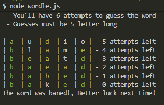
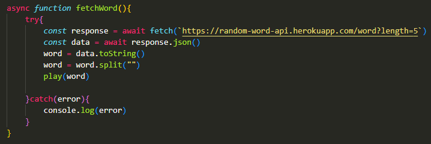
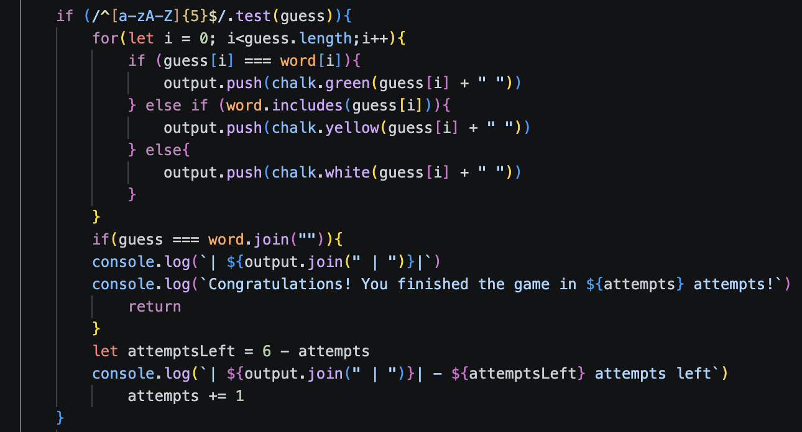

# Wordle CLI 
A command-line word guessing game where a random 5-letter word is generated. The player has six attempts to guess the word correctly. After each guess, feedback is given to indicate which letters are correct, partially correct or incorrect.

---
## Installation 
 - Clone and downlaod the repo
## Usage
- Open the terminal
- Run `npm install`
- Run `node wordle.js`

---

## Technologies
- Javascript
- Node.js

## Dependecies
- Chalk V4.1.2
- readline-sync V1.4.10

---

## Process

- Started by writing some pseudo code to break down the logic.
- Researched and found a suitable API to make the game possible.
- Used a asynchronus function to fetch and store the random 5-letter word from the API.

- Implemented a function that took a user input (guess) and checked how correct each letter was. 
- Limiting users to 6 attempts
- Only allowed entering 5-letter words.
- Changed the colour of the ltters accordingly
- End the game if guessed or they ran out of attempts

---
## Wins
- Implemeneted user input for guesses in the terminal.
- Adding colours to indicate correct, partially correct or incorrect letters.
- Successfully integrated and fetched data from an external API.

## Challenges
- Resolving compatibility issues between dependency versions
- Handling,storing and displaying user input effectively

---
## Bugs
- No validation to check whether the user's 5-letter guess is a valid word.
- Users can input the same word multiple times
---

## Future Features
- Add word validation
- Display a letter bank to show which letters have been used
